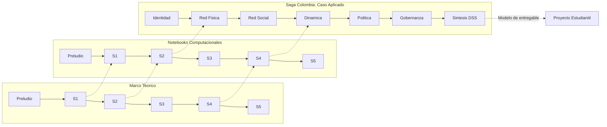
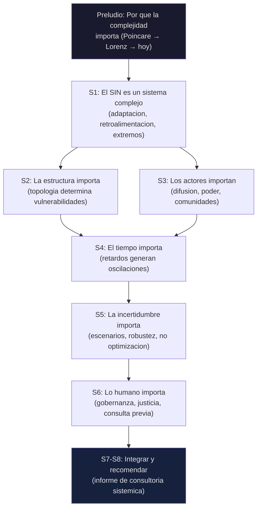

# Analisis de Sistemas -- Paquete Didactico Integral

## Arquitectura del Material

El curso opera en **tres lineas de contenido** que corren en paralelo y se refuerzan mutuamente. Cada semana, el estudiante recibe material de las tres lineas, generando una experiencia que va de lo conceptual a lo computacional a lo aplicado.

| Linea | Proposito | Formato | Audiencia primaria |
|-------|-----------|---------|-------------------|
| **Marco Teorico** | Fundamentacion conceptual, historica y cientifica | Markdown (lectura guiada, guion de video) | Estudiante (previo a sesion) |
| **Notebooks** | Laboratorio computacional, herramientas reproducibles | Jupyter (.ipynb) con celdas interactivas | Estudiante (manos en codigo) |
| **Saga Colombia** | Caso de estudio integrador del SIN colombiano | Jupyter ejecutivo (DSS, dashboards, recomendaciones) | Profesor (demo), Estudiante (referencia de proyecto) |

---

## Mapa Tematico Semana a Semana

### Preludio: Fundamentos Cientificos

> Preambulo conceptual que contextualiza el curso en la tradicion cientifica de sistemas complejos.

| Dimension | Contenido |
|-----------|-----------|
| **Marco Teorico** | [preludio_fundamentos.md](file:///c:/Users/ch.gomez171/Documents/GitHub/Systems_Analytics_MISE/marco_teorico/preludio_fundamentos.md) -- De Poincare a Lorenz: origenes de la no linealidad. Ecuacion logistica, bifurcaciones, strange attractors. Mandelbrot y las distribuciones de cola pesada. Fundamentacion para entender por que los sistemas energeticos no se comportan como modelos lineales. |
| **Notebook** | [preludio_fundamentos.ipynb](file:///c:/Users/ch.gomez171/Documents/GitHub/Systems_Analytics_MISE/notebooks/preludio_fundamentos.ipynb) -- Mapa logistico interactivo, diagramas de bifurcacion, atractores de Lorenz en 3D, distribuciones de cola pesada vs gaussianas. Animaciones de trayectorias. |
| **Saga** | -- (el preludio es transversal, no especifico al caso colombiano) |
| **Resultado** | Contextualiza O1 (no linealidad, eventos extremos) |

---

### Semana 1: Que Significa "Sistemico"

> Del pensamiento lineal al pensamiento complejo. Caso ancla: El Nino 2015-2016.

| Dimension | Contenido | Aporte al proyecto |
|-----------|-----------|-------------------|
| **Marco Teorico** | [semana_01_complejidad.md](file:///c:/Users/ch.gomez171/Documents/GitHub/Systems_Analytics_MISE/marco_teorico/semana_01_complejidad.md) -- Vocabulario de la complejidad: adaptacion, retroalimentacion, emergencia, no linealidad, retardos, path dependency, tipping points. Casos internacionales (blackouts EE.UU., India, Espana; Energiewende; lock-in gas). | Ficha de proyecto: caso, actores, preguntas |
| **Notebook** | [semana_01_complejidad.ipynb](file:///c:/Users/ch.gomez171/Documents/GitHub/Systems_Analytics_MISE/notebooks/semana_01_complejidad.ipynb) -- Simulacion de trafico (automatas celulares), diagramas espacio-tiempo, CLDs interactivos, leyes de potencia. Primeras visualizaciones con `mise_utils`. | Mapa causal informal del caso |
| **Saga** | [saga_01_identidad.ipynb](file:///c:/Users/ch.gomez171/Documents/GitHub/Systems_Analytics_MISE/notebooks/saga_01_identidad.ipynb) -- TASCOI/CATWOE del SIN, cadena de valor (generacion-transmision-distribucion-comercializacion), formula tarifaria, subsidios cruzados, CLD del ciclo inversion-precio. | Modelo de como identificar y descomponer el sistema |
| **Resultado** | O1: adaptacion, no linealidad, retroalimentaciones |

---

### Semana 2: Redes I -- Topologia, Vulnerabilidades y Confiabilidad

> La estructura del sistema electrico como red compleja. Caso ancla: STN como grafo.

| Dimension | Contenido | Aporte al proyecto |
|-----------|-----------|-------------------|
| **Marco Teorico** | [semana_02_redes_topologia.md](file:///c:/Users/ch.gomez171/Documents/GitHub/Systems_Analytics_MISE/marco_teorico/semana_02_redes_topologia.md) -- Grafos, metricas de centralidad (degree, betweenness, closeness, eigenvector), distribucion de grado, redes libres de escala vs aleatorias, criterio N-1, fallas en cascada. Euler-Konigsberg, Erdos-Renyi, Barabasi-Albert. | Esquema de redes del caso (600 palabras) |
| **Notebook** | [semana_02_redes_topologia.ipynb](file:///c:/Users/ch.gomez171/Documents/GitHub/Systems_Analytics_MISE/notebooks/semana_02_redes_topologia.ipynb) -- Construccion de redes en NetworkX, calculo de metricas, visualizacion, comparacion de topologias (ER vs BA vs WS), test N-1, simulacion de cascadas. | Herramientas para Lab 1 |
| **Saga** | [saga_02_estructura_fisica.ipynb](file:///c:/Users/ch.gomez171/Documents/GitHub/Systems_Analytics_MISE/notebooks/saga_02_estructura_fisica.ipynb) -- Red del STN (45 nodos, 52 aristas), ranking de betweenness, diagnostico N-1, simulacion de cascada sobre subestaciones reales. Dashboard de vulnerabilidades. | Modelo de analisis de red fisica |
| **Resultado** | O2: analisis de redes, metricas, fallas en cascada |

---

### Semana 3: Redes II -- Actores, Difusion y Dinamica sobre Redes

> De la estructura a la dinamica. Caso ancla: adopcion solar via redes sociales.

| Dimension | Contenido | Aporte al proyecto |
|-----------|-----------|-------------------|
| **Marco Teorico** | [semana_03_redes_dinamica_actores.md](file:///c:/Users/ch.gomez171/Documents/GitHub/Systems_Analytics_MISE/marco_teorico/semana_03_redes_dinamica_actores.md) -- Redes de actores, deteccion de comunidades (Louvain), difusion (modelo Bass, curvas S), contagio simple vs complejo, umbrales de adopcion, influencia de la topologia en la velocidad de difusion. | **Avance 1**: CLD + analisis de red |
| **Notebook** | [semana_03_redes_dinamica.ipynb](file:///c:/Users/ch.gomez171/Documents/GitHub/Systems_Analytics_MISE/notebooks/semana_03_redes_dinamica.ipynb) -- Deteccion de comunidades, simulacion SIR/Bass, contagio complejo con umbrales, visualizacion animada de difusion, comparacion small-world vs scale-free en velocidad de adopcion. | Herramientas para Lab 2 |
| **Saga** | [saga_03_estructura_social.ipynb](file:///c:/Users/ch.gomez171/Documents/GitHub/Systems_Analytics_MISE/notebooks/saga_03_estructura_social.ipynb) -- Red institucional TASCOI, mercado mayorista, HHI, comunidades de mercado, curva S solar Colombia, simulacion de adopcion en barrio. Diagnostico de concentracion. | Modelo de analisis de red de actores |
| **Resultado** | O2: dinamica sobre redes, difusion |

---

### Semana 4: Dinamica de Sistemas I -- Stocks, Flujos y Retroalimentacion

> El sistema como maquina de retroalimentacion. Caso ancla: ciclo inversion-capacidad del SIN.

| Dimension | Contenido | Aporte al proyecto |
|-----------|-----------|-------------------|
| **Marco Teorico** | [semana_04_dinamica_sistemas.md](file:///c:/Users/ch.gomez171/Documents/GitHub/Systems_Analytics_MISE/marco_teorico/semana_04_dinamica_sistemas.md) -- Stocks y flujos, ecuaciones diferenciales ordinarias (ODEs), lazos de retroalimentacion positivos (refuerzo) y negativos (balance), retardos, arquetipos de comportamiento (crecimiento exponencial, logistico, oscilatorio, overshoot-and-collapse). Sterman, Forrester. | Modelo SD del caso del grupo |
| **Notebook** | [semana_04_dinamica_sistemas.ipynb](file:///c:/Users/ch.gomez171/Documents/GitHub/Systems_Analytics_MISE/notebooks/semana_04_dinamica_sistemas.ipynb) -- Construccion de modelos SD en Python (scipy.integrate), crecimiento exponencial, busqueda de objetivo, modelo de ducha, Beer Game, modelo de inversion-capacidad del SIN. | Herramientas para Lab 3 |
| **Saga** | [saga_04_dinamica.ipynb](file:///c:/Users/ch.gomez171/Documents/GitHub/Systems_Analytics_MISE/notebooks/saga_04_dinamica.ipynb) -- Datos historicos 2000-2024, modelo basico calibrado (3 stocks), barrido de retardo de construccion, modelo extendido CxC+FNCER (5 stocks), comparacion con/sin CxC, validacion con datos historicos. | Modelo de calibracion y analisis dinamico |
| **Resultado** | O3: modelos SD calibrados con datos del sector |

---

### Semana 5: Dinamica de Sistemas II -- Politicas, Escenarios y Robustez

> De comprender a decidir. Caso ancla: escenarios de inversion en el SIN.

| Dimension | Contenido | Aporte al proyecto |
|-----------|-----------|-------------------|
| **Marco Teorico** | [semana_05_politicas_escenarios.md](file:///c:/Users/ch.gomez171/Documents/GitHub/Systems_Analytics_MISE/marco_teorico/semana_05_politicas_escenarios.md) -- Analisis de escenarios (no son pronosticos), framework XLRM, Robust Decision Making, minimax regret, analisis de sensibilidad, diagrama de tornado. Marchau, Walker, Lempert. | **Avance 2**: SD calibrado + escenarios |
| **Notebook** | [semana_05_politicas_escenarios.ipynb](file:///c:/Users/ch.gomez171/Documents/GitHub/Systems_Analytics_MISE/notebooks/semana_05_politicas_escenarios.ipynb) -- Intervenciones de politica (CxC, FNCER, impuesto carbono), simulacion factorial (4 escenarios x 3 estrategias), tabla de robustez (minimax regret), diagrama de tornado. | Herramientas para Lab 4 |
| **Saga** | [saga_05_politica.ipynb](file:///c:/Users/ch.gomez171/Documents/GitHub/Systems_Analytics_MISE/notebooks/saga_05_politica.ipynb) -- Escenarios Colombia (BAU, Gas Shock, Solar Revolution, El Nino Extremo), estrategias (Conservadora, Agresiva Renovable, Diversificada), tabla de robustez, recomendacion ejecutiva a UPME. | Modelo de decisiones bajo incertidumbre |
| **Resultado** | O3: escenarios, robustez, politicas |

---

### Semana 6: Integracion -- Gobernanza, Justicia y la Dimension Humana

> Lo que el modelo no captura. Caso ancla: Windpeshi (La Guajira).

| Dimension | Contenido | Aporte al proyecto |
|-----------|-----------|-------------------|
| **Marco Teorico** | [caso_colombia_sistema_electrico.md](file:///c:/Users/ch.gomez171/Documents/GitHub/Systems_Analytics_MISE/marco_teorico/caso_colombia_sistema_electrico.md) (transversal) + video-lecciones 6.1-6.4 sobre Ostrom, Sovacool, consulta previa, comunicacion de complejidad. | Seccion de gobernanza del informe |
| **Notebook** | (No hay notebook semanal dedicado -- la integracion usa herramientas de S2-S5) | Role-play con fichas de rol |
| **Saga** | [saga_06_gobernanza.ipynb](file:///c:/Users/ch.gomez171/Documents/GitHub/Systems_Analytics_MISE/notebooks/saga_06_gobernanza.ipynb) -- Lo que el modelo no captura, Ostrom (8 principios aplicados al SIN), justicia energetica (Sovacool), caso Windpeshi (4 capas), framework multi-capa, fichas de rol (EPM, Wayuu, CREG, ANLA). | Modelo de integracion cuali-cuantitativa |
| **Resultado** | O4: dimension social, gobernanza, justicia energetica |

---

### Semana 7: Construccion del Proyecto -- Taller de Integracion

> De analista a consultor. Semana taller: no se introduce contenido nuevo.

| Dimension | Contenido | Aporte al proyecto |
|-----------|-----------|-------------------|
| **Marco Teorico** | Video-lecciones 7.1-7.2 sobre integracion y comunicacion de complejidad. Page, *The Model Thinker*. | **Avance 3**: Integracion completa |
| **Notebook** | (No hay notebook nuevo -- los grupos trabajan con herramientas de S1-S5 sobre su caso) | Peer review + ensayo de presentacion |
| **Saga** | [saga_07_sintesis.ipynb](file:///c:/Users/ch.gomez171/Documents/GitHub/Systems_Analytics_MISE/notebooks/saga_07_sintesis.ipynb) -- Dashboard DSS de 6 paneles, tabla resumen ejecutivo, 5 recomendaciones estrategicas, limitaciones, horizonte futuro (ABM, RDM, ML). Informe exportable. | **Gold standard** del informe final |
| **Resultado** | O1-O4 integrados |

---

### Semana 8: Cierre -- Presentaciones Finales y Horizontes Futuros

> Del analisis sistemico a la accion estrategica. Panel con invitado del sector.

| Dimension | Contenido | Aporte al proyecto |
|-----------|-----------|-------------------|
| **Marco Teorico** | Video-leccion 8.1: ABM (Mesa), RDM (PRIM/Rhodium), ML sobre redes. | Reflexion individual (500 palabras) |
| **Notebook** | -- | **Informe final** (6,000-8,000 palabras) |
| **Saga** | La Saga 7 es el modelo de referencia para el informe final. | Presentacion ante panel (15 min) |
| **Resultado** | Evaluacion sumativa: panel + informe |

---

## Alineacion con Resultados de Aprendizaje

| Resultado | Semanas Clave | Marco Teorico | Notebook | Saga |
|-----------|:---:|:---:|:---:|:---:|
| **O1** -- Analizar proyectos como sistema complejo (adaptacion, no linealidad, retroalimentacion, memoria, extremos) | Preludio, S1 | Preludio + S1 | Preludio + S1 | Saga 1 |
| **O2** -- Aplicar analisis de redes (topologia, metricas, leyes de potencia, cascadas, dinamica sobre redes) | S2, S3 | S2 + S3 | S2 + S3 | Saga 2 + Saga 3 |
| **O3** -- Construir modelos SD (stocks, flujos, ciclos, retardos), calibrar, intervenciones, escenarios | S4, S5 | S4 + S5 | S4 + S5 | Saga 4 + Saga 5 |
| **O4** -- Integrar dimension social/ambiental/gobernanza, recomendaciones estrategicas accionables | S6, S7, S8 | S6 (transversal) | -- | Saga 6 + Saga 7 |

---

## Inventario de Recursos Computacionales

### Modulo `mise_utils/` -- Libreria de soporte del curso

| Modulo | Funciones principales | Semanas |
|--------|----------------------|---------|
| [`viz.py`](file:///c:/Users/ch.gomez171/Documents/GitHub/Systems_Analytics_MISE/notebooks/mise_utils/viz.py) | `apply_mise_style()`, paleta `COLORS`, estilos consistentes | Todas |
| [`complexity.py`](file:///c:/Users/ch.gomez171/Documents/GitHub/Systems_Analytics_MISE/notebooks/mise_utils/complexity.py) | `simular_trafico()`, `dibujar_cld()`, `plot_diagrama_espacio_tiempo()` | S1 |
| [`foundations.py`](file:///c:/Users/ch.gomez171/Documents/GitHub/Systems_Analytics_MISE/notebooks/mise_utils/foundations.py) | Mapa logistico, Lorenz, distribuciones cola pesada | Preludio |
| [`networks.py`](file:///c:/Users/ch.gomez171/Documents/GitHub/Systems_Analytics_MISE/notebooks/mise_utils/networks.py) | `calcular_todas_metricas()`, `test_resiliencia()`, `simular_cascada()`, `comparar_resiliencia()` | S2 |
| [`diffusion.py`](file:///c:/Users/ch.gomez171/Documents/GitHub/Systems_Analytics_MISE/notebooks/mise_utils/diffusion.py) | `simular_contagio_complejo()`, `detectar_comunidades()`, `visualizar_comunidades()` | S3 |
| [`dynamics.py`](file:///c:/Users/ch.gomez171/Documents/GitHub/Systems_Analytics_MISE/notebooks/mise_utils/dynamics.py) | `modelo_inversion_capacidad()`, `modelo_inversion_con_cxc_fncer()`, `simular_escenarios()`, `tabla_robustez()`, `analisis_sensibilidad()`, `plot_tornado()` | S4, S5 |
| [`energy_data.py`](file:///c:/Users/ch.gomez171/Documents/GitHub/Systems_Analytics_MISE/notebooks/mise_utils/energy_data.py) | `crear_red_sin_simplificada()`, `generar_precios_bolsa()`, `crear_red_barrio()`, `generar_adopcion_solar_colombia()` | S2-S5 |
| [`colombia_sin.py`](file:///c:/Users/ch.gomez171/Documents/GitHub/Systems_Analytics_MISE/notebooks/mise_utils/colombia_sin.py) | `TASCOI`, `CATWOE`, `GENERADORES`, `INSTITUCIONES`, `MARCO_REGULATORIO`, `FORMULA_TARIFARIA`, `SUBSIDIOS_ESTRATO`, `crear_red_cadena_valor()`, `crear_red_institucional()`, `datos_historicos_colombia()` | Saga |
| [`saga.py`](file:///c:/Users/ch.gomez171/Documents/GitHub/Systems_Analytics_MISE/notebooks/mise_utils/saga.py) | `save_state()`, `load_state()`, `dashboard_dss()`, `tabla_resumen_ejecutivo()`, `export_report()` | Saga 7 |

---

## Hilo Narrativo: Del Concepto a la Decision

El arco narrativo del curso se resume en una progresion de cinco "importa":

1. **La complejidad importa** -- los modelos lineales fallan en sistemas con retroalimentacion, retardos y adaptacion
2. **La estructura importa** -- la topologia de la red determina donde se propagan las fallas y como fluye el poder
3. **El tiempo importa** -- los retardos de construccion generan oscilaciones endogenas que ningun shock externo explica
4. **La incertidumbre importa** -- no buscar la decision optima sino la decision robusta ante futuros que no controlamos
5. **Lo humano importa** -- la gobernanza, la justicia energetica y la consulta previa son la meta-capa que condiciona todo lo demas

---

## Estado Actual del Material

| Recurso | Estado | Archivos |
|---------|--------|----------|
| Marco Teorico (Preludio + S1-S5) | Completo | 7 documentos .md en `marco_teorico/` |
| Caso transversal Colombia | Completo | `caso_colombia_sistema_electrico.md` |
| Notebooks didacticos (Preludio + S1-S5) | Completo, verificados | 6 notebooks .ipynb |
| Saga Colombia (7 notebooks DSS) | Completo, verificados | 7 notebooks .ipynb |
| Modulos `mise_utils/` | Completo, compilados | 9 modulos .py |
| Marco Teorico S6-S7 | Parcial | Contenido en video-lecciones del programa |
| Quizzes y bancos de preguntas | Pendiente | -- |
| Rubrica detallada del proyecto | Pendiente (estructura definida en programa) | -- |
| Material S6 (Windpeshi como notebook) | Cubierto por Saga 6 | `saga_06_gobernanza.ipynb` |
